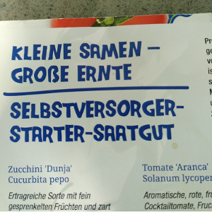
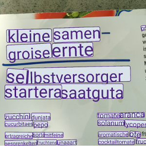

# openread

Automatically read text in photos with this easy-to-use Android (kotlin) library. 




__WARNING__: This library is currently in alpha version. No known major bugs, but the
text recognition is quite slow and recognition quality is not always up to scratch. Please
try the library out extensively before committing to using it.

## Add openread to your Android dependencies

In your `settings.gradle`, configure the custom maven repository:

```groovy
dependencyResolutionManagement
    ...
    repositories {
        ...
        maven {
            url "https://gitlab.com/api/v4/projects/38250497/packages/maven"
        }
    }
}
```

And add the library to your app's `build.gradle`

```groovy
implementation 'io.krasch:openread:0.0.7'
```
## Example usage

```kotlin
import android.graphics.BitmapFactory
import io.krasch.openread.models.Openread

// initialize the library
// the context is only used to load the necessary files, no reference to it is kept
val openread = Openread.initialize(context)  // this is a suspend function

// load a bitmap from assets
// just a simple example, you can also take bitmaps from the camera gallery etc
val image = BitmapFactory.decodeStream(assets.open("example.jpg"))

// run the text recognition (might take a long while!)
// returns a List<Pair<AngledRectangle, String>>
// where AngledRectangle is the box around the text and String is the found text
val results = openread.run(image) // this is also a suspend function
```

Beware that initializing the library and running the text recognition is done
in a [coroutine](https://developer.android.com/kotlin/coroutines), since quite some computationally heavy
work is being performed. 

### More examples

Have a look at the `app` folder for a more involved example that also displays
intermediary recognition results (sorry for the current state of the app code, 
definitely needs a round of cleaning up).

## Known limitations

openread is in alpha stage and actively being developed. As such there are still quite
considerable limitations:

#### Slow recognition performance

Text recognition in openread runs in two stages:

1. The image is given to a deep learning model to find all text in the image. This stage has
already been optimized for smartphone use and is pretty fast (<1 second on a 2019 mid-range phone).
2. Each instance of text is fed to a second deep learning model to read the text. This stage has NOT been
optimized for smartphone use and is quite slow (~1 second per text instance).

#### Mediocre recognition quality

Text is found with quite good accuracy, but reading the text can definitely still
be improved. Reason is that the two models mentioned in the previous section 
are currently not well calibrated for each other. Best to check with your own
images if the currently quality is good enough for your use case.

#### Large library size

The library includes the full tensorflow lite library, which itself comes in
at ~30MB, most of which is actually not needed. Recompiling tensorflow lite
to only included the necessary parts should reduce its footprint considerably.

## Technical details

[Custom model training code for the text detection model](https://gitlab.com/krasch/craft-mini)

[Official model code for the text recognition model by ClovaAI](https://github.com/clovaai/deep-text-recognition-benchmark)


## Contact

You can contact the main developer at dev@krasch.io

Have a specific text recognition use case that might include considerable
extra development / model finetuning? Don't hesitate to contact us, we can work this out for 
you on a freelance basis.

Want to license this library under something other than GPL? Again, don't hesitate to get in contact!

## Funding


[](https://www.bmbf.de/)
[](https://prototypefund.de/)
